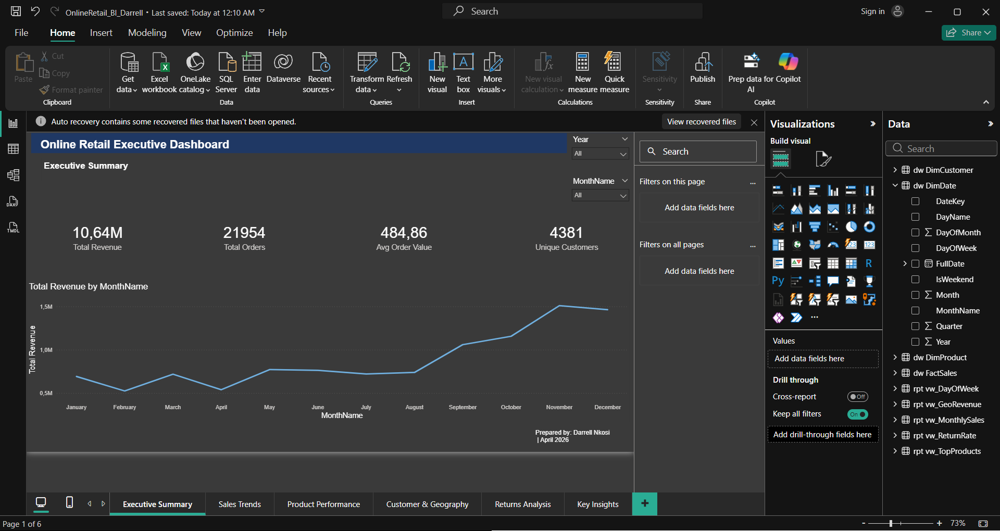
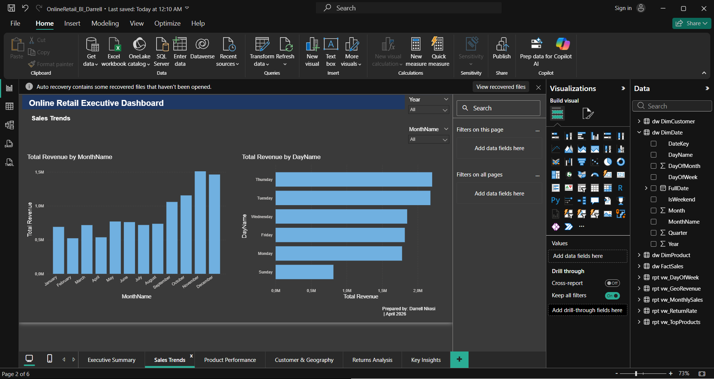
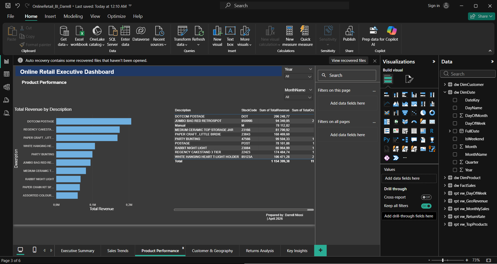
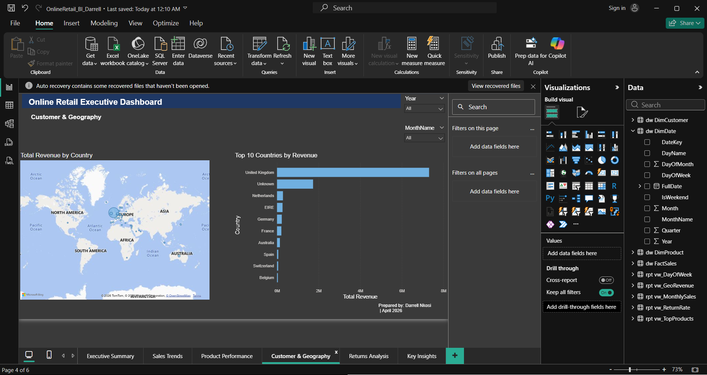
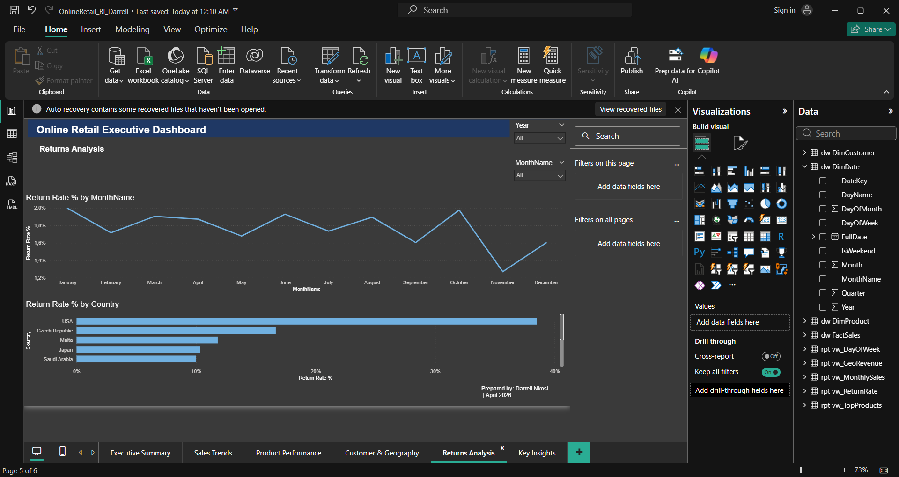
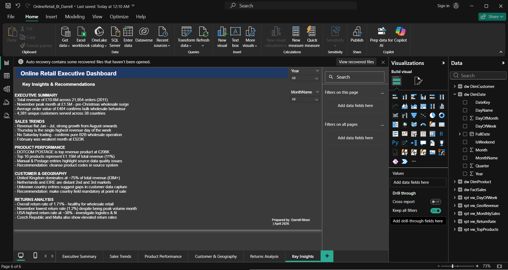

# Online Retail BI Dashboard
**Tools:** Python · SQL Server · Power BI · DAX · Star Schema · ETL

A complete end-to-end Business Intelligence project from 541,909 rows
of raw retail data to a 6-page executive Power BI dashboard.

-

## What This Project Does
Transforms raw transactional CSV data into a professional executive
dashboard using a full BI pipeline — Python for ingestion, SQL Server
for warehousing, and Power BI for reporting.

-

## Project Architecture

| Day | What Was Built |
|-----|---------------|
| Day 1 | Python ETL: 541,909 rows loaded into SQL Server staging table |
| Day 2 | Star schema designed: DimDate, DimCustomer, DimProduct, FactSales |
| Day 3 | Full ETL: 541,799 clean rows, £10,644,560.42 revenue validated, 0 orphaned keys |
| Day 4 | 5 analytical views built in rpt schema |
| Day 5 | Power BI connected, 9 DAX measures written and validated |
| Day 6 | 6-page executive dashboard built |
| Day 7 | Dashboard polished with slicers, insights, and CEO recommendations |

-

## Key Findings

- November peak revenue: £1.5M (+78% year-on-year)
- UK = ~75% of £10.6M total revenue across 38 countries
- No Saturday trading — confirms pure B2B wholesale business
- USA flagged at ~38% return rate — highest risk market
- Average order value: £484 — confirms bulk wholesale behaviour
- Overall return rate: 1.71% — healthy for wholesale retail

-

## Dashboard Pages

| Page | What It Shows |
|------|--------------|
| Executive Summary | 4 KPI cards + revenue trend line chart |
| Sales Trends | Monthly revenue + day-of-week analysis |
| Product Performance | Top 10 products by revenue |
| Customer & Geography | World map + top 10 countries |
| Returns Analysis | Return rate trends + highest-risk markets |
| Key Insights | CEO-level recommendations |

-

## Screenshots

-

## Files in This Repo

| File | What It Does |
|------|-------------|
| `load_data.py` | Python script that loads the CSV into SQL Server staging |
| `OnlineRetail_BI_Darrell.pbix` | Full interactive Power BI dashboard |
| `sql/create_tables.sql` | Creates all schemas, staging table, and star schema tables |
| `sql/etl_factsales.sql` | ETL scripts for DimCustomer, DimProduct, and FactSales |
| `sql/create_views.sql` | Creates all 5 analytical views in the rpt schema |

> Note: The full SSMS-generated database script is 495MB and exceeds
> GitHub's file size limit. The three scripts above contain all the
> core logic needed to fully recreate the data warehouse from scratch.

-

## Dataset

The dataset used is the **Online Retail Transactions (UCI)** dataset.

[Download from Kaggle](https://www.kaggle.com/datasets/fareselgohary003/online-retail-transactions-uci)

Once downloaded, save the CSV as `C:\Data\online_retail.csv` and run
`load_data.py` to load it into SQL Server.

-

## Power BI Dashboard

Download `OnlineRetail_BI_Darrell.pbix` from this repo and open it
in **Power BI Desktop** (free download from Microsoft).

Once open, go to **Transform Data → Data Source Settings** and update
the server name to your local SQL Server instance.

-

## How to Run This Project

### Requirements
- Python 3.8+
- SQL Server or SQL Server Express (free)
- Power BI Desktop (free download from Microsoft)

### Steps

1. Clone this repo
2. Download the dataset from the Kaggle link above and save to `C:\Data\online_retail.csv`
3. Run `pip install pandas pyodbc`
4. Open `load_data.py` and update the server name to your SQL Server instance
5. Run `python load_data.py` to load the data
6. Open SSMS and run the SQL scripts in this order:
   - `sql/create_tables.sql`
   - `sql/etl_factsales.sql`
   - `sql/create_views.sql`
7. Open `OnlineRetail_BI_Darrell.pbix` in Power BI Desktop
8. Update the SQL Server connection to your local instance

-

## Built By

**Darrell Velenkosini Nkosi**
BCIS Honours Student — University of the Free State
IBM Award (2024) | BBD Award (2025) | Graduated with Distinction (2026)

[Portfolio](https://darrellnkosi.vercel.app) | [LinkedIn](https://www.linkedin.com/in/darrell-nkosi-86797a28b) | [GitHub](https://github.com/VelenkosiniNkosi)
